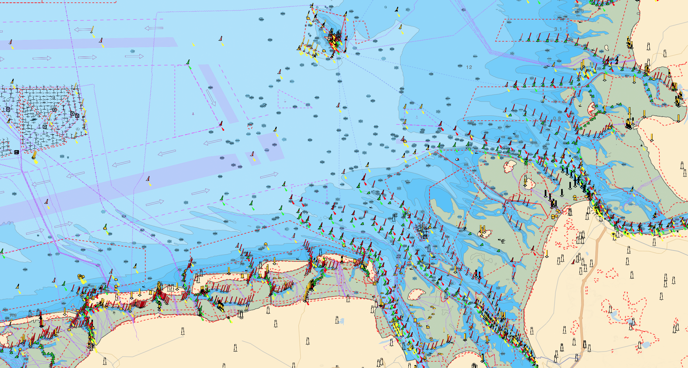
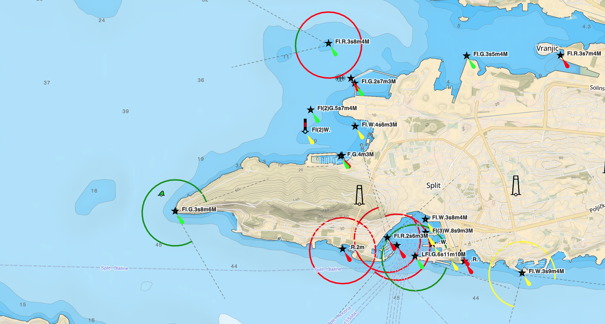

# Seamap.java - Planetiler Profile for Nautical Charts




## Overview
This Java file implements a Planetiler profile that converts OpenStreetMap data directly into PMTiles vector tiles for nautical charts.
Additionally all Bathymetry/Contours/Spotsoundings are rendered ondemand via a pached version of the [maplibre-contour](https://github.com/prozessor13/maplibre-contour) plugin.

To simplify installation there is a (in beta state) [signalk-seamap-plugin](https://github.com/prozessor13/signalk-seamap-plugin) to allow partial downloads of all map source for offline-usage.

## Features

### 1. Seamark Base Objects (`seamark:*` tags)
- Processes all seamark types: buoys, beacons, lights, landmarks, harbours, etc.
- Extracts comprehensive attributes:
  - `osm_id`, `type`, `name`, `reference`, `function`, `category`, `shape`
  - `color`, `color_pattern` (with semicolon → underscore conversion)
  - `light` (abbreviated format), `light_color`, `light_sequence`
  - `topmark_color`, `topmark_shape` (sanitized)
- Creates separate layers:
  - `seamark_point` - Point features
  - `seamark_linestring` - Line features
  - `seamark_polygon` - Polygon features with additional label points (PointOnSurface)

### 2. Derived Seamark Features
Maps standard OSM tags to seamark types:

| OSM Tags | Seamark Type | Category | Geometries |
|----------|--------------|----------|------------|
| `route=ferry` | `ferry_route` | - | linestring |
| `waterway:sign=anchor` | `anchorage` | - | point/line/polygon |
| `power=cable` + `location=underwater` | `cable_submarine` | `power` | linestring |
| `man_made=pipeline` + `location=underwater` | `pipeline_submarine` | substance | linestring |
| `man_made=pier` | `mooring` | `pier` | point/line/polygon |
| `leisure=marina` | `harbour` | `marina` | line/polygon |
| `leisure=swimming_area\|nature_reserve` | `restricted_area` | leisure value | line/polygon |
| `man_made=tower\|windmill\|gasometer` | `landmark` | `man_made` | point |
| `man_made=lighthouse` | `lighthouse` | - | point (with full light attributes) |

### 3. Land Layer
- Downloads and processes global land polygons from [osmdata.openstreetmap.de](https://osmdata.openstreetmap.de/data/land-polygons.html)
- Source: `land-polygons-split-4326.zip` (~600 MB)
- Projection: WGS84 (EPSG:4326)
- Automatic download on first run if not present
- Creates `land` layer with polygon features
- Attributes: None (simple land mask geometry)
- Buffer: 4 pixels for smooth rendering at tile boundaries

### 4. Light Sector Layer
Generates geometric representations of light sectors for navigational lights:

#### Light Geometries
- **Arcs**: Colored sector arcs showing the visible range of each light color
- **Rays**: Lines at sector boundaries marking the transitions between colors

#### Light Types
| Type | Arc Radius | Ray Radius |
|------|------------|------------|
| `light_major` | 0.7 NM (~1296m) | 2.5 NM (~4630m) |
| `light_minor` | 0.4 NM (~741m) | 1.2 NM (~2222m) |

#### Attributes
- `osm_id` (integer) - Reference to parent seamark
- `type` (string) - Parent seamark type (e.g., `light_major`, `light_minor`)
- `subtype` (string) - Geometry type: `arc` or `ray`
- `color` (string) - Light color for arcs (e.g., `red`, `green`, `white`)
- `range` (string) - Nominal range in nautical miles
- `sector_start` (integer) - Start bearing in degrees (0-360, for arcs only)
- `sector_end` (integer) - End bearing in degrees (0-360, for arcs only)

#### Source Tags
Processes `seamark:light:N:*` tags where N is the sector number:
- `seamark:light:N:colour` - Light color
- `seamark:light:N:range` - Nominal range
- `seamark:light:N:sector_start` - Sector start bearing
- `seamark:light:N:sector_end` - Sector end bearing

#### Example
For a lighthouse with red (0-120°) and green (120-240°) sectors:
- 2 arc features (one red, one green)
- 4 ray features (at 0°, 120°, 120°, 240°)

### 5. Places Layer
- Extracts `natural=bay` features
- Creates point geometry:
  - Points: direct geometry
  - Lines: centroid point
  - Polygons: point on surface
- Attributes: `osm_id`, `type`, `subtype`, `name`, `reference`

### 6. Default Values for IALA Maritime Buoyage System
Implements automatic defaults for standardized seamark types:

#### Cardinal Marks
- **North**: black_yellow horizontal, 2 cones up, black topmark
- **East**: black_yellow_black horizontal, 2 cones base together, black topmark
- **South**: yellow_black horizontal, 2 cones down, black topmark
- **West**: yellow_black_yellow horizontal, 2 cones point together, black topmark

#### Isolated Danger
- Color: red_black_red horizontal
- Topmark: 2 spheres, black

#### Safe Water
- Color: red_white vertical
- Topmark: sphere, red

#### Special Purpose
- Color: yellow

#### Generic Defaults
- All beacons: shape = buoyant (transformed from pile)
- All buoys: shape = pillar
- Colors with underscore: color_pattern = horizontal

### 5. Light Abbreviation
Replicates SQL `seamark_light_abbr()` function:
- Format: `<character>(<group>).<COLORS>.<period>s<height>m<range>M`
- Supports single and multi-light configurations
- Extracts max range per color
- Example: `Fl(3).WRG.10s15m12M`


## Usage

### Download Planetiler

Download the latest [Planetiler](https://github.com/onthegomap/planetiler):

```bash
wget https://github.com/onthegomap/planetiler/releases/latest/download/planetiler.jar
```

### Compile
```bash
javac -cp planetiler.jar *.java
```

### Run
```bash
java -Xmx4g -cp planetiler.jar:. Seamap \
  --download \
  --area=croatia \
  --output=seamarks.pmtiles \
  --force
```

Or for a local OSM file:
```bash
java -Xmx4g -cp planetiler.jar:. Seamap \
  --osm-path=data/austria.osm.pbf \
  --output=seamarks.pmtiles \
  --force
```

## Output Layers

### Point/Line/Polygon features for all seamark objects

**Attributes:**
- `osm_id` (integer)
- `type` (string) - seamark type
- `name` (string)
- `reference` (string)
- `function` (string)
- `category` (string)
- `shape` (string)
- `color` (string)
- `color_pattern` (string)
- `light` (string) - abbreviated light characteristics
- `light_color` (string)
- `light_sequence` (string)
- `topmark_color` (string)
- `topmark_shape` (string)

**Note:** Polygon features also generate a corresponding point feature for labeling (using point on surface).


## Build PMTiles file for the whole planet

This command takes about 1h on a strong hetzner machine (Ryzen 9 & 128 GB RAM)

    java -Xmx20g   -XX:+UseParallelGC   -XX:ParallelGCThreads=4   -cp "/app/classes:/app/libs/*:/app/resources:."   Seamap.java   --download   --osm-url=https://planet.openstreetmap.org/pbf/planet-latest.osm.pbf   --maxzoom=14  --output=/data/seamap.pmtiles   --tmp=/data/tmp   --nodemap-type=array   --storage=mmap   --threads=20   --download-threads=10   --http-retries=3   --force

## Demo Page (seamap.html)

The [seamap.html](https://prozessor13.github.io/seamap/seamap.html#10.81/36.128/-5.3433) file provides a complete MapLibre GL JS demonstration of the nautical chart visualization.

### Data Sources

#### 1. Base Map
- **Provider**: [VersaTiles](https://tiles.versatiles.org)
- **Style**: Colorful style with desaturated colors (-30% saturation)
- **Purpose**: Base map with streets, labels, and general cartography

#### 2. Seamark Vector Tiles
- **Source**: MapToolkit Data Connector
- **Endpoint**: `https://dataconnector.maptoolkit.net/seamap/seamap/{z}/{x}/{y}.pbf`
- **Pmtiles Source**: `https://fsn1.your-objectstorage.com/mtk-seamap/seamap.pmtiles`
- **Format**: Vector tiles (PMTiles served via API)
- **Max Zoom**: 14
- **Layers**:
  - `seamark` - All nautical features (buoys, beacons, lights, etc.)
  - `land` - Land polygons for coastline
  - `light` - Light sector geometries (arcs and rays)

#### 3. Seamark Sprites
- **Source**: MapToolkit Icons
- **Endpoint**: `http://icons.maptoolkit.net/seamap`
- **Format**: Sprite sheets with S-57 nautical symbols
- **Purpose**: Icon rendering for buoys, beacons, landmarks, etc.

#### 4. Land Hillshading & Contours
- **Provider**: [Mapterhorn](https://tiles.mapterhorn.com)
- **Endpoint**: `https://tiles.mapterhorn.com/{z}/{x}/{y}.webp`
- **Encoding**: Terrarium (RGB-encoded elevation)
- **Max Zoom**: 12
- **Features**:
  - Hillshading with 0.2 exaggeration
  - Dynamically generated contour lines
  - Contour intervals: 200m/1000m (z7), 100m/500m (z8-9), 50m/200m (z10), 20m/100m (z11), 10m/50m (z12)

#### 5. Bathymetry (EMODnet)
- **Source**: MapToolkit Data Connector (EMODnet Bathymetry 2024)
- **Endpoint**: `https://dataconnector.maptoolkit.net/seamap/emod/{z}/{x}/{y}.webp`
- **Gebco Pmtiles Source**: `https://fsn1.your-objectstorage.com/mtk-seamap/emod.pmtiles`
- **Emodnet Pmtiles Source**: `https://fsn1.your-objectstorage.com/mtk-seamap/gebco.pmtiles`
- **Encoding**: Terrarium (RGB-encoded depth values)
- **Max Zoom**: 11 (9 for Gebco)
- **Coverage**: European waters (worldwide for Gebco)
- **Features**:
  - Bathymetric hillshading (0.2 exaggeration)
  - Dynamically generated depth contours
  - Contour lines at: 0m, 2m, 5m, 10m, 20m, 50m, 100m, 250m, 500m, 1000m, 2000m, 3000m, 4000m, 5000m
  - Depth area fills: 0-2m, 2-5m, 5-10m, 10-20m, 20-50m
  - Spot soundings (depth labels) with 32-pixel grid spacing
  - All Contour/Bathymetry/Spotsounding features a created ondemand in the browser via the [maplibre-contours](https://github.com/prozessor13/maplibre-contour) plugin

### Technology Stack

- **MapLibre GL JS**: Open-source map rendering engine
- **maplibre-contour** (v0.2.8): Plugin for dynamic contour generation from DEM tiles
- **VersaTiles Style**: Base map styling library

### Features Rendered

The demo visualizes:
- **Bathymetry**: Colored depth zones with contours and soundings
- **Land**: Coastline with terrain hillshading and elevation contours
- **Seamarks**: Buoys, beacons, lights with IALA colors and symbols
- **Light Sectors**: Colored arcs and rays showing navigational light coverage
- **Navigation**: Traffic separation schemes, fairways, anchorages
- **Hazards**: Rocks, wrecks with appropriate symbols
- **Infrastructure**: Cables, pipelines, platforms, landmarks

## Create EMODnet Bathymetry

### Download data

Download EMODnet bathymetry dataset (NetCDF format with elevation data for European waters)

    wget https://erddap.emodnet.eu/erddap/files/bathymetry_dtm_2024/EMODnet_bathymetry_2024.nc

Download OSM land polygons (global coastline shapefile in WGS84)

    wget https://osmdata.openstreetmap.de/download/land-polygons-complete-4326.zip
    unzip land-polygons-complete-4326.zip

### Process bathymetry data

1. Extract elevation layer from NetCDF and convert to GeoTIFF
    - Assigns WGS84 coordinate system (EPSG:4326)
    - Converts from NetCDF format to standard GeoTIFF raster
```
gdal_translate -a_srs EPSG:4326 NETCDF:"EMODnet_bathymetry_2024.nc":elevation bathymetry_elevation.tif
```

2. Rasterize land polygons to mask land areas
   - burn 0: Set land pixels to elevation 0 (sea level)
   - init nan: Initialize all pixels as NaN (no data)
   - tr: Target resolution ~0.00104° (~115m at equator, matching EMODnet resolution)
   - te: Extent covering Europe (-36°W to 43°E, 15°N to 90°N)
   - ot Float32: Output as 32-bit floating point for precise elevation values
```
gdal_rasterize -burn 0 -init nan -a_nodata nan -tr 0.001041666666666 0.001041666666666 -te -36 15 43 89.999999999933507 -ot Float32 -of GTiff -l land_polygons land-polygons-complete-4326/land_polygons.shp land0.tif
```

3. Merge land mask with bathymetry data
   - Overlays land0.tif (land=0) onto bathymetry_elevation.tif (ocean depths)
   - Preserves NaN values where no data exists in either source
   - Result: Combined raster with land at 0m and bathymetry for sea areas
```
gdalwarp -overwrite -ot Float32 -srcnodata "nan" -dstnodata "nan" -of GTiff land0.tif bathymetry_elevation.tif merged.tif
```

4. Fill small gaps in data using interpolation
   - md 5: Maximum distance of 5 pixels to search for valid values
   - Interpolates missing data (NaN) using surrounding valid pixels
   - Creates seamless bathymetry raster without gaps
```
gdal_fillnodata.py -md 5 merged.tif filled.tif
```

5. Create raster-dem tiles

This command takes about 10h on a strong Hetzner machine

```
rio rgbify -v -e terrarium --min-z 3 --max-z 11 -r -2 -j 4 --format webp filled_clipped.vrt emod.mbtiles
pmtiles convert emod.mbtiles emod.pmtiles
```
